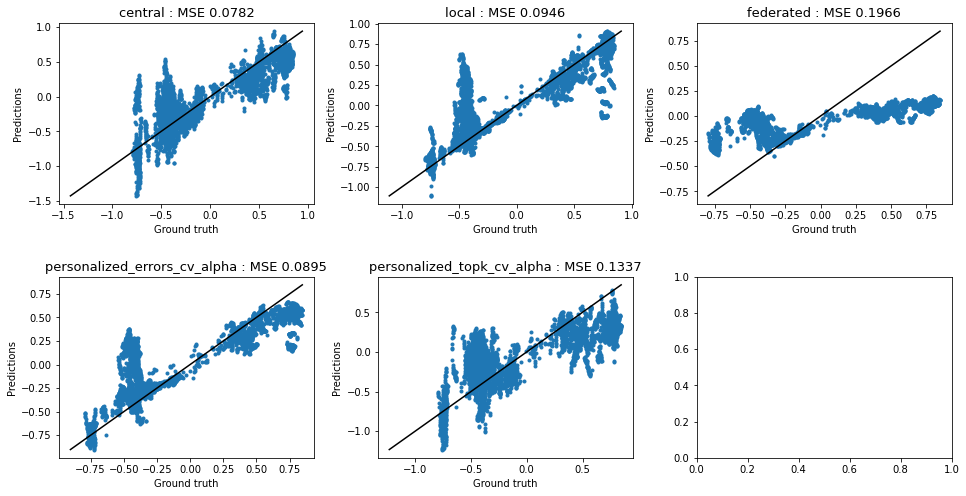

# persavg

This repository provides the source code for the paper : **Personalized One-Shot Collaborative Learning**

First install the dependencies with:
```
pip install -r requirements.txt
```

Then download the datasets using the following URLs:
- CT-SCan [link](https://archive.ics.uci.edu/dataset/206/relative+location+of+ct+slices+on+axial+axis)
- Space-ga [link](https://mljar.com/machine-learning/use-case/space-ga/)
- Energy [link](https://archive.ics.uci.edu/dataset/321/electricityloaddiagrams20112014)
- GreenHouseGas [link](https://archive.ics.uci.edu/dataset/206/relative+location+of+ct+slices+on+axial+axis)

Then store the datasets in a `./datasets` folder

The synthetic experiments can be run with the following command line:
```
pyhton main_synthetic.py
```
And the "real-life" experiments with:
```
pyhton main.py
```

You can also run the algorithms for one configuration at a time through the `example.ipynb` notebook. You will get the following kind of validation plot:


